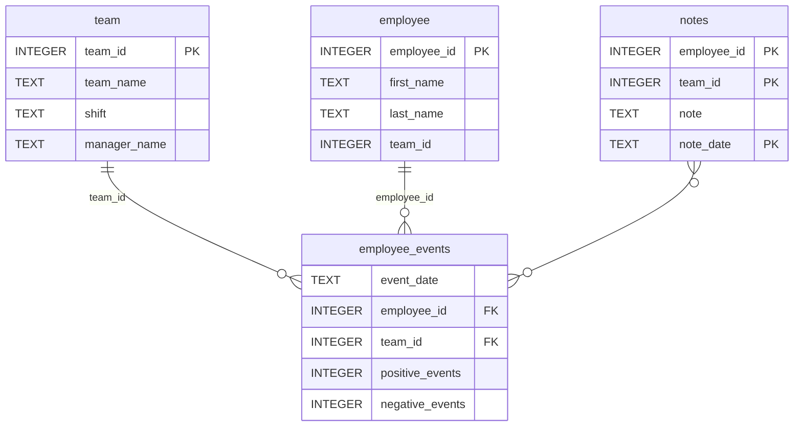

# Software Engineering for Data Scientists 

This repository contains starter code for the **Software Engineering for Data Scientists** final project. Please reference your course materials for documentation on this repository's structure and important files. Happy coding!

### Repository Structure
```
├── README.md
├── assets
│   ├── model.pkl
│   └── report.css
├── env
├── python-package
│   ├── employee_events
│   │   ├── __init__.py
│   │   ├── employee.py
│   │   ├── employee_events.db
│   │   ├── query_base.py
│   │   ├── sql_execution.py
│   │   └── team.py
│   ├── requirements.txt
│   ├── setup.py
├── report
│   ├── base_components
│   │   ├── __init__.py
│   │   ├── base_component.py
│   │   ├── data_table.py
│   │   ├── dropdown.py
│   │   ├── matplotlib_viz.py
│   │   └── radio.py
│   ├── combined_components
│   │   ├── __init__.py
│   │   ├── combined_component.py
│   │   └── form_group.py
│   ├── dashboard.py
│   └── utils.py
├── requirements.txt
├── start
├── tests
    └── test_employee_events.py
```

### Environment Setup

**Python Version**: This project requires **Python 3.10** or higher (tested with Python 3.10.10). You can use tools like [pyenv](https://github.com/pyenv/pyenv) or [uv](https://github.com/astral-sh/uv) to manage the correct Python version automatically.

To install the required dependencies and the local package:

```bash
python -m pip install --upgrade pip
python -m pip install -r requirements.txt
```

The root `requirements.txt` installs the dashboard dependencies and the local `python-package` editable package.

### employee_events.db


